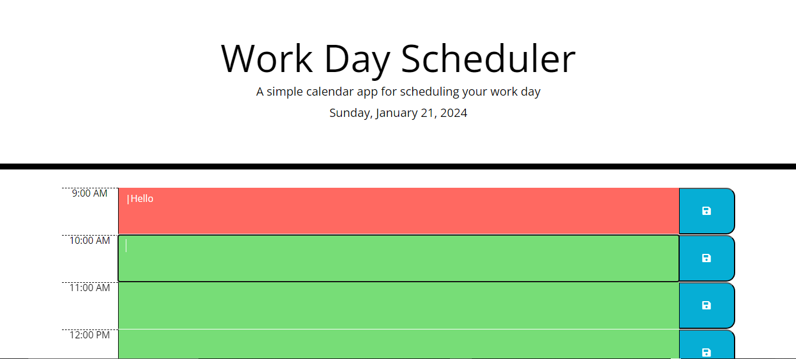

# Feyse Work Day Scheduler App

## Overview
A Simple Calendar App to Plan Your Workday.
Manage your busy schedule effectively with this handy daily planner!

## Table of Contents

- [Introduction](#introduction)
- [Features](#features)
- [Demo](#demo)
- [Technologies Used](#technologies-used)
- [Getting Started](#getting-started)
- [Usage](#usage)
- [Contributing](#contributing)
- [License](#license)
- [Contact](#contact)

## Introduction

The Work Day Scheduler is a simple calendar application that allows users to save events for each hour of the day. It is designed to help users manage their time effectively.

## Features

- Displays the current day at the top of the calendar.
- Shows timeblocks for standard business hours (9 AM to 5 PM).
- Color-codes timeblocks based on past, present, and future.
- Allows adding events to specific timeblocks.
- Saves events in local storage for persistence between page refreshes.

## Demo

View a live demo of the Coding Quiz App [here](https://dodomiyake.github.io/feyse-workday-scheduler-app/).



## Technologies Used

- HTML: Structure and content of the app.
- CSS: Styling and visual presentation.
- JavaScript: Dynamic functionality and user interactions.
- jQuery: Handling DOM manipulation and event handling.
- Day.js: Working with dates and times in a human-friendly way.

## Getting Started

1. Clone the repository:

    ```bash
    git clone https://github.com/your-username/workday-scheduler-app.git
    cd workday-scheduler-app
    ```

2. Open the `index.html` file in your preferred web browser.

## Usage

- View the current day displayed at the top.
- Scroll down to see the timeblocks.
- Click a timeblock to enter an event.
- Type your event in the input field that appears.
- Click the "Save" button to store the event in local storage.
- Refresh the page to see saved events persist.

## Contributing

Feel free to contribute to this project!

1. Fork the repository.
2. Create a new branch: `git checkout -b feature-name`.
3. Make your changes and commit them: `git commit -m 'Add feature'`.
4. Push to the branch: `git push origin feature-name`.
5. Submit a pull request.

## Acknowledgments

Feel free to explore and customize the Coding Quiz App based on your project's needs.

## Contact

- Email: [oluwadamilola.william@gmail.com](mailto:oluwadamilola.william@gmail.com)
- LinkedIn: [Oluwadamilola's LinkedIn Profile](https://www.linkedin.com/in/oluwadamilolaxajayi)
- GitHub: [Dodo Miyake on GitHub](https://github.com/dodomiyake)

Looking forward to connecting with you!

---
